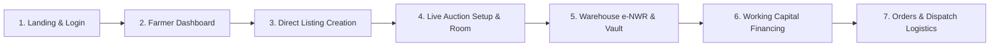

# 🎥 AGRAMAZ — Complete Farmer Workflow Video Recording Guide

This step-by-step production script ensures you cover **100% of the features** in the Farmer experience without missing any action, modal, or detail during your screen recording.

---

## 🎬 Pre-Recording Setup & Tips
1. **Screen Resolution**: Set browser zoom to **100%** (1920×1080 Full HD recommended).
2. **Clean Session**: Open an incognito window or clear `localStorage` so seed data starts fresh.
3. **Cursor Pacing**: Move your mouse smoothly and pause for **1–2 seconds** on each modal and card so viewers can read key details.
4. **Recording Tools**: OBS Studio, Loom, or Windows Game Bar (`Win + G`).

---

## 📋 Comprehensive Scene-by-Scene Checklist

---

### 🟢 Scene 1: Landing Page & Fast Demo Login (0:00 – 0:45)
- [ ] **1.1 Start at Landing Page (`/`)**:
  - Show the hero banner: *"Fairer, Direct Agricultural Exchange"*.
  - Scroll down briefly through the **Selling Methods** (Direct Selling, Live Auction, e-NWR Cold Storage).
- [ ] **1.2 Click "Sign In" (Top Right)**:
  - You land on the Login screen.
  - Highlight the **"Quick Demo Accounts"** section.
  - Click on **"Sakthi Vel — Farmer (Salem, TN)"**.
  - Click **"Sign In as Farmer"**.

---

### 🟢 Scene 2: Farmer Dashboard Tour (0:45 – 1:30)
- [ ] **2.1 Welcome Banner**:
  - Point to *"Good morning/afternoon, Sakthi Vel 🌾"*.
  - Point out the top quick-links: `[ 🏢 Warehouse (3) ]`, `[ 🚚 Deliveries (4) ]`, and `[ + List Produce ]`.
- [ ] **2.2 Overview Stat Cards**:
  - Hover over the 4 metric cards:
    1. **Active Listings** (`3 Fixed-price direct lots`)
    2. **Stored Inventory** (`8.0 T • 3 active e-NWR receipts`)
    3. **Orders Received** (`7 • Pending fulfillment`)
    4. **Financing Desk** (`₹21k active liquidity`)
- [ ] **2.3 Certified Cold Storage Vault Banner**:
  - Scroll down to the banner *"Sell or Auction Directly from Certified Cold Storage"*.
  - Hover over the **"Warehouse Vault →"** button.

---

### 🟢 Scene 3: Creating a Direct Sale Listing (1:30 – 2:45)
- [ ] **3.1 Click "+ List Produce" (Hero Banner)**:
  - Lands on the **Create Listing** form.
- [ ] **3.2 Fill Produce Details**:
  - **Commodity**: Select *Tomato* 🍅.
  - **Variety**: Type *Hybrid Shivam*.
  - **Grade**: Select *Grade A*.
  - **Available Quantity**: Enter *2,500 kg*.
  - **Unit Price**: Enter *₹45 / kg*.
  - **Location**: Enter *Salem District, Tamil Nadu*.
- [ ] **3.3 Click "Preview Listing"**:
  - Shows the **Listing Preview** card with instant total value calculation (`2,500 kg × ₹45 = ₹1,12,500`).
- [ ] **3.4 Click "Publish to Marketplace"**:
  - Redirects automatically to **My Listings (`farmer-my-listings`)**.
  - Show the filter tabs (`All (4)`, `Active (3)`, `Pending (1)`).

---

### 🟢 Scene 4: Live Auction Creation & Real-Time Auction Room (2:45 – 4:00)
- [ ] **4.1 Navigate to Trading Desk ➔ Digital Auctions**:
  - Click **"Trading Desk"** in the top navbar $\rightarrow$ select **"Digital Auctions"**.
- [ ] **4.2 Click "+ Launch New Auction"**:
  - Enter Commodity: *Turmeric (Salem Finger)*.
  - Base Start Price: *₹120 / kg*.
  - Reserve Price (Hidden Minimum): *₹145 / kg*.
  - Duration: *2 Hours*.
  - Click **"Schedule & Launch Auction"**.
- [ ] **4.3 Enter the Live Auction Room**:
  - Click **"Monitor Live Room"** on an active auction card.
  - Highlight the **Live Countdown Clock**, **Current Highest Bid Card**, and the **Real-Time Bids Feed**.
  - Click **"← Back to Auctions"**.

---

### 🟢 Scene 5: Warehouse Storage, e-NWR Receipts & Selling from Vault (4:00 – 5:30)
- [ ] **5.1 Navigate to Services & Vault ➔ Warehouse & e-NWR (`farmer-inventory`)**:
  - Point to the **4 Vault Metrics** (Total Stored Produce, Valuation, Certified Warehouses).
- [ ] **5.2 Deposit Produce into Cold Storage**:
  - Click the green **"+ Deposit Produce"** button.
  - In the modal, select *Salem Agri Cold Storage Hub*, Chamber *Cold Chamber B4*, Quantity *1,500 kg*.
  - Click **"Confirm Warehouse Deposit"**.
- [ ] **5.3 Inspect the Clean 2-Row Inventory Cards**:
  - Point to the clean card showing `#eNWR-1024`, Available `1,500 kg`, and Est. Value `₹84,000`.
- [ ] **5.4 Click "View e-NWR" (Bottom Left Button)**:
  - The **WDRA Certificate Modal Overlay** opens!
  - Highlight the **NABL Laboratory Assay Results** (Moisture 88.5%, Grade A Certified).
  - Highlight the **Chamber details** and **Blockchain Legal Title**.
  - Close the modal.
- [ ] **5.5 Click "Sell from Storage" (Full-Width Top Button)**:
  - Opens the **List from Inventory Modal**.
  - Show that farmers can sell directly on the spot marketplace or launch an auction **without transporting produce out of storage**.
  - Close the modal.

---

### 🟢 Scene 6: Applying for Working Capital Financing (5:30 – 6:30)
- [ ] **6.1 On the Inventory Card, Click "Finance"**:
  - Opens the **e-NWR Financing Request Modal**.
- [ ] **6.2 Show Loan Terms**:
  - Point to the **70% Loan-to-Value (LTV)** preset (`₹58,800`).
  - Select Purpose: *Input Procurement (Seeds, Fertilizer & Fuel)*.
  - Select Repayment: *Auto-deduction on AGRAMAZ escrow payout*.
  - Click **"Submit Financing Request"**.
- [ ] **6.3 View Financing Desk (`farmer-financing`)**:
  - Show the status badge: *Pending Underwriting*.

---

### 🟢 Scene 7: Order Tracking & Dispatch Logistics (6:30 – 7:30)
- [ ] **7.1 Navigate to Fulfillment ➔ Orders Received (`farmer-orders`)**:
  - Show incoming buyer purchase orders with **100% Escrow Protected** badges.
  - Click **"View Order Lifecycle"** on an order to show the timeline.
- [ ] **7.2 Navigate to Fulfillment ➔ Deliveries & Dispatch (`farmer-deliveries`)**:
  - Show carrier dispatch status (*In Transit*, *GPS Handover Protocol*).
  - Click **"View Delivery"** to show the driver details and origin-to-destination route.
- [ ] **7.3 Wrap Up & Sign Out**:
  - Scroll back to the top navbar.
  - Click **"Sign Out"** to end on the clean landing page.

---

## 🎯 Summary of Key Talking Points for Voiceover

| Feature | What to Say in the Video |
| :--- | :--- |
| **Direct Selling** | *"Farmers set their own fair price with 0% broker deductions."* |
| **Live Auctions** | *"Competitive real-time bidding ensures maximum price discovery for high-grade lots."* |
| **e-NWR Storage** | *"Avoid distress selling during harvest glut by storing in certified cold storage with electronic WDRA receipts."* |
| **Pledge Financing** | *"Instant 70% cash advances against stored crops for next-season seeds and fertilizer."* |
| **100% Escrow** | *"Goods are only dispatched once buyer payment is locked safely in escrow — zero payment default risk."* |
